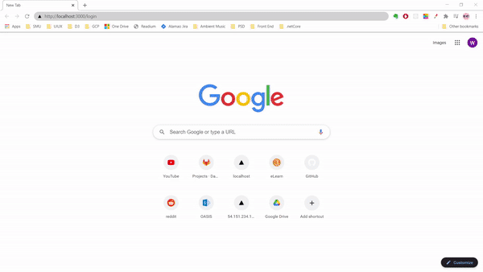

<div align="center">
  <h1>
       
      <br>
          Carpark Availability Application
      <br>
  </h1>
</div>

<div align="center">
  <p>
    <a href="#installation-guide">Installation Guide</a> •
      <a href="#file-structure">File Structure</a>  
  </p>
</div>

# Installation Guide

1. Download files from GitHub

OR

1. clone repo from

```
git clone https://github.com/abelwong2017/CarparkAvail.git
```

2. Check respective README files in Backend and Frontend Folder for the installation guide

# File Structure

## Backend

-   Contains backend files built using .Net Core with MySQL

## Frontend

-   Contains frontend files built using Create React App
